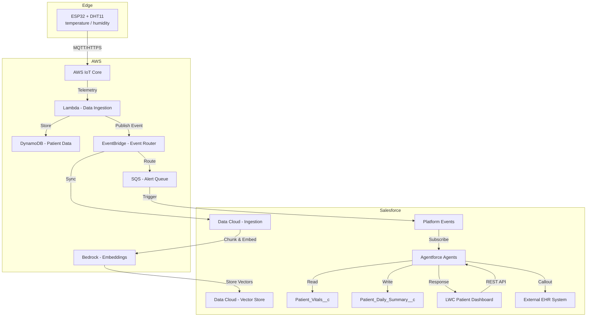

# Cloud-Agentic-IoT: Architecture Overview

## System Architecture

## A note on the sensor data

The physical device is an **ESP32 with a DHT11** — temperature and humidity only. The data model (`Patient_Vitals__c`, the alert thresholds in chapter `02`) also carries heart rate, SpO2 and blood pressure fields, because that is what a real patient monitor produces and the architecture should not have to change when the sensor does.

Those additional fields are populated by simulation, not by the hardware. Any content or demo should say so — a viewer can see a DHT11 on the breadboard.

## Data Flow

1. **Edge**: Wearable IoT device collects patient vitals (heart rate, SpO2, temperature, blood pressure)
2. **AWS Ingestion**: IoT Core receives telemetry, Lambda processes and stores in DynamoDB
3. **Data Cloud Sync**: Patient data syncs into Data Cloud via External Objects
4. **RAG Pipeline**: Data is chunked, embedded (Bedrock), and indexed in Vector Store
5. **Platform Events**: Real-time alerts published to Platform Events
6. **Agentforce**: Agents consume Platform Events, retrieve context from Vector Store, and take actions
7. **External Systems**: Agents call EHR APIs, create Support Cases, update patient records

## Key Components

| Component | Purpose | Technology |
|-----------|---------|------------|
| Patient Device | Collects vitals, actuates on command | Physical ESP32 + DHT11 + servo (chapter `00`) |
| Queue Indicator | Physical Case-queue depth display | ESP32 + servo, driven by custom metadata (chapter `03`) |
| Slack Bot | Headless Salesforce read/write from chat | Lambda + JWT Bearer Flow (chapter `04`) |
| Data Ingestion | Transform and route telemetry | AWS Lambda |
| Data Cloud | Unified patient data engine | Salesforce Data Cloud |
| Vector Store | Semantic search for patient context | Data Cloud + Bedrock |
| Platform Events | Real-time alert distribution | Salesforce Platform Events |
| Agentforce | Autonomous patient monitoring | Agentforce Topics + Actions |
| Patient Dashboard | LWC UI for care teams | Lightning Web Components |
| EHR Integration | Sync with external health systems | REST API + OAuth 2.0 |

## Security

- **PII Masking**: Patient data masked before LLM processing
- **Field-Level Security**: Agents run in designated user context
- **Audit Trail**: All agent actions logged to Agent_Audit_Log__c
- **Guardrails**: Prompt injection detection, business rule enforcement
- **HIPAA Compliance**: Data encryption, access controls, audit logging
