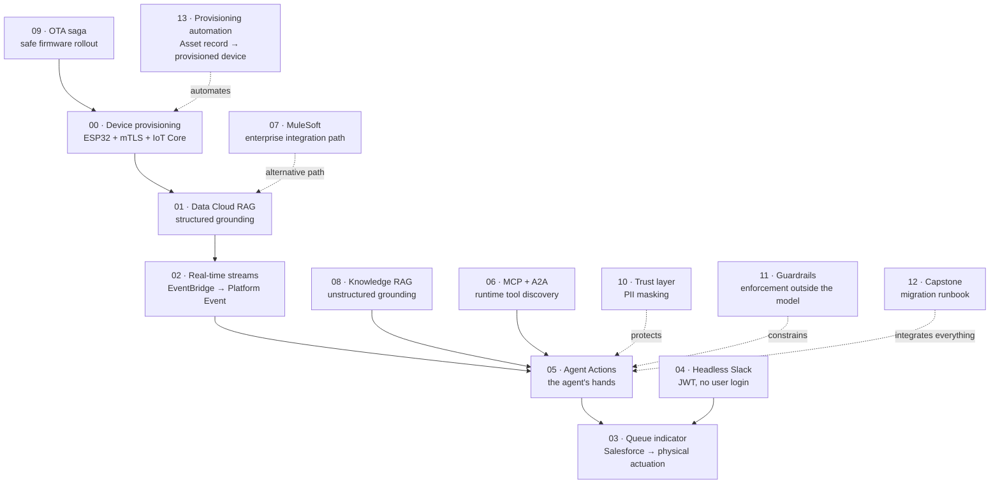

# How It Connects

Short answer: **it is one system, not fourteen demos.** Each chapter is an independently deployable slice, but they share a data model, a device fleet, and a set of integration seams. Deploy them all and you get a single working loop.

This document exists because "fourteen chapters" can read as fourteen unrelated tutorials, and that would undersell the thing considerably.

Chapters are **directories under `content/`, not branches.** All the code lives together on `Dev` in one standard layout — `force-app/`, `lambda/`, `firmware/` — so a chapter is a slice of one project rather than a copy of it. `Prod` is the promotion target for verified work.

## The one sentence version

A physical sensor emits data → AWS ingests and enriches it → Salesforce stores and reasons over it → an AI agent decides something → and that decision travels back out to move a motor on a desk.

## The loop, in order

## What each chapter actually contributes

| Chapter | Its job in the system | Depends on | Depended on by |
|---|---|---|---|
| **00** Device provisioning | Gets real data out of a physical device securely (mTLS, least-privilege IoT policy) | — | 01, 03, 09, 13 |
| **01** Data Cloud RAG | Turns telemetry into structured records and embeddings the agent can retrieve | 00 | 02, 05, 07 |
| **02** Real-time streams | Detects a condition worth acting on, publishes it as a Platform Event | 01 | 05, 09, 11 |
| **03** Queue indicator | Proves the loop closes: business state moves a physical motor | 00, 02 | — (the visible payoff) |
| **04** Headless Slack | A second front door into the same actions, with no Salesforce login | 05 | — |
| **05** Agent Actions | The agent's hands — the only place an agent decision becomes a side effect | 02, 06, 08 | 03, 04, 12 |
| **06** MCP + A2A | How the agent discovers what tools exist, at runtime | 01, 03 | 05 |
| **07** MuleSoft | The same ingestion as 01, via the enterprise iPaaS path | 00 | — (alternative to 01) |
| **08** Knowledge RAG | Unstructured grounding, so the agent's advice cites real protocols | — | 05 |
| **09** OTA saga | Updates the firmware from 00 without bricking the fleet | 00, 02 | — |
| **10** Trust layer | Masks PII before anything reaches the model | — | 05 (cross-cutting) |
| **11** Guardrails | Enforces what the agent may do, outside the model | 02 | 05 (cross-cutting) |
| **12** Capstone | Integrates everything and adds the migration runbook | all | — |
| **13** Provisioning automation | Turns 00's manual setup into a record-driven workflow | 00 | — |

## The three integration seams

Almost all coupling flows through three shared interfaces. This is deliberate — it is why chapters can be built and deployed in any order without reworking each other.

**1. The MQTT topic pair.** Every device speaks `telemetry` (device → cloud) and `command` (cloud → device). Chapter 00 defines it; 03, 09 and 13 reuse it without modification. A new device type is a new Thing, not a new protocol.

**2. Platform Events.** Chapter 02 publishes `Patient_Vital_Alert__e`; chapter 03 publishes `Queue_Depth_Change__e`. Anything may subscribe — the agent, an LWC dashboard, the relay Lambda — without the publisher knowing. This is why adding the Slack front door in chapter 04 required no change to chapter 03.

**3. Custom metadata as configuration.** Chapter 03's `Device_Queue_Binding__mdt` means binding a new device to a new queue is a config record, not a deployment. The same principle scales to the rest.

## Two pairs that are deliberate alternatives, not additions

- **01 vs 07** do the same job — AWS telemetry into Salesforce — one as a Lambda, one as a MuleSoft flow. Having both is the point: the architecture review question is not "can you build it" but "when would you choose each," and the answer is a governance decision about who owns integration logic, not a technical one.
- **10 and 11** are cross-cutting rather than sequential. Neither is a step in the pipeline; both wrap the agent wherever it runs.

## The order to demo them in

Not numerical order. Strongest narrative first:

1. **00** — a real device, real certificates, data arriving
2. **03** — the motor moves when a Case lands in a queue. This is the moment people lean in
3. **02 + 05** — the agent detects and acts autonomously
4. **04** — the same action from Slack, with nobody logged into Salesforce
5. **10 + 11** — and here is why it is safe to let it do that
6. **13** — and here is how you onboard the hundredth device without a runbook
7. **12** — and here is how it goes to production

## Honest note on the current state

Every chapter is written and locally verified — firmware compiles, Node handlers are tested, Apex is reviewed. **None of it has been deployed to a real AWS account or Salesforce org yet.** The connections described above are how the system is designed to fit together; proving they fit is the deploy-and-verify work still ahead.
